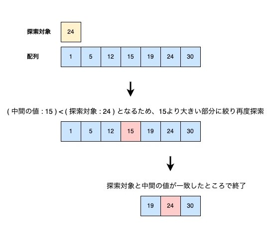
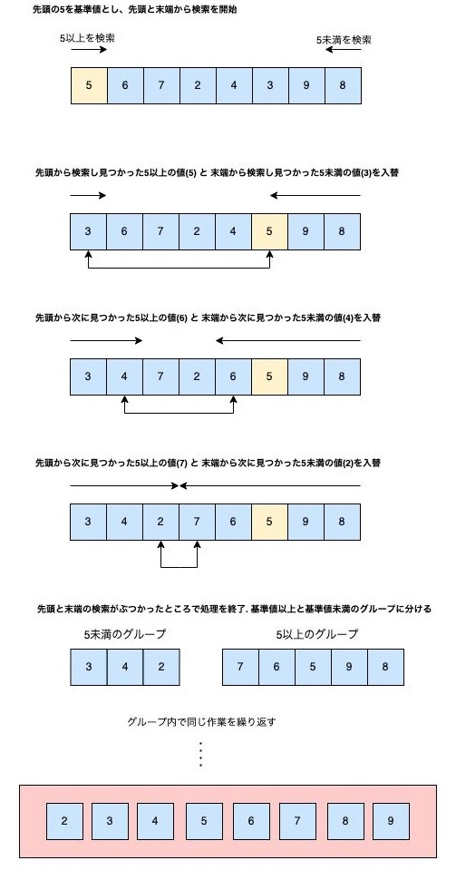

# 20220611-event-questions

## 概要

以下は、6/11(土)開催の「エンジニア学生のためのIT業界研究セミナー」に  
参加するために用意されたコーディング問題です。  
問題は3問ありますが、1,2問目は解答必須、3問目はチャレンジ問題とします。  
高得点を狙う方は、是非3問目にもチャレンジしてください。

## 問題タイトル

- 解答必須問題

    1. FizzBuzz問題
    2. 探索アルゴリズムの実装

- チャレンジ問題

    3. ソートアルゴリズムの実装

各問題の詳細は後述します。

## 対応言語

対応言語は下記の8つです。
- Java
- JavaScript
- Python3
- PHP
- C#
- Kotlin
- Swift
- Go

言語による採点結果への優劣はありませんので、得意な言語で挑戦してください。

## 採点基準

採点するにあたり、下記のルールは遵守しててください。
1. 実行してエラーとならないこと
2. 正しい結果が得られること
3. 出題したアルゴリズムを利用して結果が得られていること
4. 解答導出に必要のない処理が書かれていないこと

※　ただし、問題３に関しては採点基準の1 ~ 4のルールを満たしていなくても  
　　部分点を獲得できるので是非チャレンジして提出してみてください。

5. 解答用テンプレートに記載のコメント「ここから記述」から「ここまで記述」の間に解答が追記されていること

上記のルールを守った上で、下記の項目を満たす書き方の場合、高得点を獲得することができます。

6. 空行等で、コード量や処理の意味が適切に区切られていること
7. 読み手の理解しやすい順序で処理が書かれていること
8. 命名が適切であること
9. 記述が冗長でないこと
10. 読み手の理解を助けるコメントが書かれていること

## 評価ランク
上記の評価基準で採点してランク付けされます。

- Sランク：エース級プログラマー
    - 複雑なアルゴリズムを、リーダブルに実装できています
    - 今回のコーディングを意識しながら、色々な実装にチャレンジしてみてください
- Aランク：即戦力プログラマー
    - 複雑なアルゴリズムを、リーダブルに実装できています
    - S評価との差は、あとほんの少しの読み手への配慮だけです
- Bランク：期待の新人プログラマー
    - 基礎的なアルゴリズムを、リーダブルに実装できています
    - 複雑なアルゴリズムでも読みやすくコーディングできるようにチャレンジしてみてください
- Cランク：基礎習熟プログラマー
    - 基礎的なアルゴリズムを実装できています
    - 読み手に配慮したコーディングを意識してみましょう
- Dランク：駆け出しプログラマー
    - 要件に合うアルゴリズムが実装できていない、またはコードの可読性が低いです
    - まずは簡単なアルゴリズムから、読み手の理解しやすさを意識して書いてみましょう

## 解答方法

各問題毎に用意されたテンプレートをコピーして、コーディングをしてください。  
解答は答案者ご自身のGithubに投稿した上で、専用の[Googleフォーム](https://forms.gle/N1T77XX1ovzg1izG9)にて  
各解答への直リンクを共有してください。

## 問題
### 解答必須

問題１：FizzBuzz問題（[解答用テンプレート](/template/Q1_FizzBuzz)）
- 1から100までの数字を出力してください
- 3の倍数のときは数字の代わりにFizzと出力してください
- 5の倍数のときは数字の代わりにBuzzと出力してください
- 15の倍数のときは数字の代わりにFizzBuzzと出力してください

出力イメージ
```
1
2
Fizz
4
Buzz
Fizz
7
8
Fizz
Buzz
11
Fizz
13
14
FizzBuzz
16
...(省略)
98
Fizz
Buzz
```

問題２：探索アルゴリズムの実装（[解答用テンプレート](/template/Q2_Search)）
- 探索対象の配列から、探索する数値のindexを返却するメソッドを実装してください
- 探索対象の配列は「1つ以上の要素を持つ、昇順にソートされた重複のない整数の配列」です
- ただし、以下の条件を満たすアルゴリズムを用いて実装してください
    - 「配列の中間の値」と「探索対象の数値」の大小を比較し、中間から前後のどちらかに探索範囲を絞りながら探索を繰り返してください  
    一探索毎に探索範囲が半分になるので、データ個数がnの時の計算量がO(log2n)となります
    - 探索対象の配列に探索する数値が存在しない場合は、-1 を出力してください
    - 再帰を使用せず記述してください

例：
```
探索対象の配列が{ 1, 2, 3, 5, 12, 15, 19, 24, ..., 1234567 }の場合
    - 探索する数値が 1 であれば、0 を返却します
    - 探索する数値が 5 であれば、3 を返却します
    - 探索する数値が 10 であれば、探索対象に存在しないため -1 を返却します
```

処理の参考イメージ  




### チャレンジ問題
問題３：ソートアルゴリズムの実装（[解答用テンプレート](/template/Q3_Sort)）
- 整数の配列を昇順にソートするアルゴリズムを実装してください
- ソート対象の配列は「1つ以上の要素を持つ、ランダムに並べられた重複のない整数の配列」です
- ただし、以下の条件を満たすアルゴリズムを用いて実装してください
    - 配列の先頭を基準値とします
    - 先頭から末端に向かって、基準値以上の値の探索、逆方向から基準値の値未満の探索をし、見つかったらそれらの値同士を交換します
    - 先頭からの探索と、末端からの探索がぶつかった時点で探索を終了し、データを二つ（基準値以上のグループ、基準値未満のグループ）に分けます
    - 分けられたそれぞれのグループで、同様の処理を再帰的に繰り返し、交換する部分がなくなるまで処理を続けます

※　先述の通り、問題３に関しては採点基準の1 ~ 4のルールを満たしていなくても  
　　部分点が獲得できるので是非チャレンジしてみてください。  

処理の参考イメージ  




問題は以上です。  
